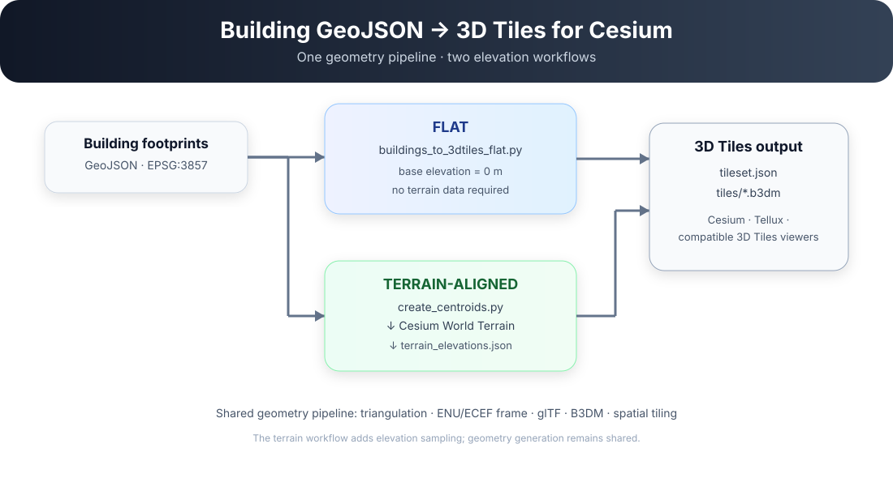

<div align="center">

# Convert Building GeoJSON to 3D Tiles for Cesium

**Turn building footprint GeoJSON into spatially tiled [3D Tiles](https://www.ogc.org/standards/3dtiles/) for Cesium-based viewers.**

[](https://www.python.org/)
[](https://www.ogc.org/standards/3dtiles/)
[](LICENSE)

[**5-Minute Quick Start**](#5-minute-quick-start) ·
[**Flat Workflow**](#flat-workflow) ·
[**Terrain-Aligned Workflow**](#terrain-aligned-workflow)

</div>

<p align="center">
  
</p>

---

## What this project does

This repository converts polygon building footprints into spatially tiled **B3DM / 3D Tiles** datasets.

There are two independent workflows:

| | Flat | Terrain-aligned |
|---|---|---|
| Script | `buildings_to_3dtiles_flat.py` | `buildings_to_3dtiles_terrain_aligned.py` |
| Base elevation | `0 m` | Cesium World Terrain height |
| Terrain data | Not required | Required |
| Cesium ion token | Not required | Required for sampling |
| Best for | Quick conversion / visualisation | Buildings placed on terrain |

Both workflows share the same geometry-generation pipeline.

---

# 5-minute quick start

Want to see it working before dealing with terrain?

Start with the **Flat** workflow. The repository already contains sample data, so no Cesium ion account or token is needed.

### 1. Clone

```bash
git clone https://github.com/PeiChiTsai/geojson-buildings-to-3dtiles.git
cd building-footprints-to-3dtiles
```

### 2. Create a virtual environment

**Windows PowerShell**

```powershell
python -m venv .venv
.venv\Scripts\activate
```

**macOS / Linux**

```bash
python -m venv .venv
source .venv/bin/activate
```

### 3. Install dependencies

```bash
pip install -r requirements.txt
```

### 4. Run the sample

```bash
python src/buildings_to_3dtiles_flat.py
```

### 5. Find the result

```text
output/my_city_flat/
├── tileset.json
├── conversion_info.json
└── tiles/
    ├── tile_0_0.b3dm
    ├── tile_0_1.b3dm
    └── ...
```

Load:

```text
output/my_city_flat/tileset.json
```

in your Cesium / Tellux application.

> **Done.** You have generated your first 3D Tiles dataset.

---

# Flat workflow

Use this workflow when all buildings should sit on a common horizontal plane.

```text
data/my_buildings.geojson
          │
          ▼
buildings_to_3dtiles_flat.py
          │
          ▼
output/my_city_flat/
```

### Run it

```bash
python src/buildings_to_3dtiles_flat.py \
  --input data/my_buildings.geojson \
  --out output/my_city_flat
```

Building elevation is:

```text
base = 0 m
top  = building height
```

### Useful options

Change the spatial grid:

```bash
python src/buildings_to_3dtiles_flat.py \
  --input data/my_buildings.geojson \
  --out output/my_city_flat \
  --nx 32 \
  --ny 32
```

Change the minimum building height:

```bash
python src/buildings_to_3dtiles_flat.py \
  --input data/my_buildings.geojson \
  --min-height 0.5
```

See all options:

```bash
python src/buildings_to_3dtiles_flat.py --help
```

---

# Terrain-aligned workflow

Use this workflow when buildings should follow **Cesium World Terrain**.

```text
Building GeoJSON
      │
      ▼
create_centroids.py
      │
      ▼
building_centroids.json
      │
      ▼
sample_cesium_world_terrain.html
      │
      ▼
terrain_elevations.json
      │
      ▼
buildings_to_3dtiles_terrain_aligned.py
      │
      ▼
output/my_city_terrain_aligned/
```

### 1. Create centroid points

```bash
python src/create_centroids.py \
  --input data/my_buildings.geojson \
  --output data/my_building_centroids.json
```

### 2. Sample terrain

Open:

```text
terrain/sample_cesium_world_terrain.html
```

Then:

1. Paste your Cesium ion access token.
2. Select `my_building_centroids.json`.
3. Click **Sample terrain**.
4. Save the downloaded `terrain_elevations.json` in `data/`.

The token is entered locally in the browser and is not stored in this repository.

### 3. Generate terrain-aligned 3D Tiles

```bash
python src/buildings_to_3dtiles_terrain_aligned.py \
  --input data/my_buildings.geojson \
  --terrain data/terrain_elevations.json \
  --out output/my_city_terrain_aligned
```

For each building:

```text
base = terrainHeight
top  = terrainHeight + building height
```

Output:

```text
output/my_city_terrain_aligned/
├── tileset.json
├── conversion_info.json
└── tiles/
    ├── tile_0_0.b3dm
    ├── tile_0_1.b3dm
    └── ...
```

Load:

```text
output/my_city_terrain_aligned/tileset.json
```

in Cesium, Tellux, or another compatible 3D Tiles viewer.

---

# Input data

The converter expects building polygons in **EPSG:3857** with these attributes:

| Field | Required | Description |
|---|:---:|---|
| `id` | ✓ | Unique building identifier |
| `height` | ✓ | Building height in metres |
| `var` | ✓ | Additional numeric attribute |
| `source` | ✓ | Source label |
| `region` | ✓ | Region label |
| `geometry` | ✓ | Polygon building footprint |

A small sample dataset is included:

```text
data/sample_buildings.geojson
```

Sample centroid data is also included:

```text
data/sample_building_centroids.json
```

More details are available in [`data/README.md`](data/README.md).

---

# Output

Each conversion produces a self-contained 3D Tiles dataset:

```text
my_city/
├── tileset.json
├── conversion_info.json
└── tiles/
    ├── tile_0_0.b3dm
    ├── tile_0_1.b3dm
    ├── tile_0_2.b3dm
    └── ...
```

### `tileset.json`

The tileset entry point.

### `tiles/*.b3dm`

The generated building tiles.

### `conversion_info.json`

Metadata describing the conversion, including grid size, elevation method, coordinate conventions, and stored attributes.

---

# Geometry and coordinate conventions

The current implementation assumes:

```text
Building input: EPSG:3857
Terrain sampling: EPSG:4326
ECEF frame: EPSG:4978
```

The converter retains the verified glTF coordinate correction:

```text
(x, y, z) → (x, z, -y)
```

Side-face winding is normalised as:

```text
Exterior ring: CCW
Interior rings: CW
```

Top and bottom caps use opposite winding.

B3DM binary buffer offsets are 4-byte aligned.

---

# Command-line reference

### Flat

```bash
python src/buildings_to_3dtiles_flat.py --help
```

```text
--input
--out
--nx
--ny
--min-height
```

### Terrain-aligned

```bash
python src/buildings_to_3dtiles_terrain_aligned.py --help
```

```text
--input
--terrain
--out
--nx
--ny
--min-height
```

---

# Repository structure

```text
geojson-buildings-to-3dtiles/
├── README.md
├── LICENSE
├── requirements.txt
├── .gitignore
│
├── docs/
│   └── workflow.svg
│
├── src/
│   ├── buildings_to_3dtiles_flat.py
│   ├── buildings_to_3dtiles_terrain_aligned.py
│   └── create_centroids.py
│
├── terrain/
│   └── sample_cesium_world_terrain.html
│
├── data/
│   ├── sample_buildings.geojson
│   ├── sample_building_centroids.json
│   └── README.md
│
└── output/
    └── .gitkeep
```

---

# License

MIT. See [`LICENSE`](LICENSE).
